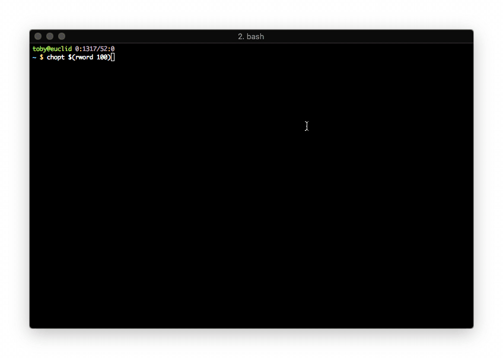

# CHOOSE OPTIONS

*A simple CLI checkbox menu interface for choosing options.*



Takes a list of options and returns a list of chosen items from that list.

Options are chosen by entering their corresponding number or name. Multiple
options can be selected in one go. Choices should be separated by spaces.

Also supported is specifying ranges of numbers, in the form *x..y* or *x-y* -
where *x* and *y* are item numbers from the list.

Additionally *..x* or *-x* specify everything up to and including *x*.

*x..* or *x-* specify everything from *x* until the last element.

One can use wildcards to match option name strings. For instance **.py* would
match all files with the extension *.py*.

Reserved words are *toggle*, *reset*, *accept* and *quit* (case
insensitive). They can be used to carry out those respective actions. Typing
just the first letter also carries out that action - ie) *t*, toggles all, *r*,
resets, etc.

It's worth re-iterating that selection always happens in a toggling manner - ie)
if some glob or range specification is re-matched a second time the items will
be toggled, not retained. I'm receptive to changing this behavior if
requested...

## INSTALLATION

`pip install chopt`

## CLI USAGE

```
usage: chopt [-h] options [options ...]

Create a checkbox menu from a list of options.

positional arguments:
  options     Options for the menu.

optional arguments:
  -h, --help  show this help message and exit
```

## PYTHON USAGE

```python
from chopt import chopt

my_list = [ 'item1', 'item2', 'item3' ]

chosen = chopt(my_list)

some_interesting_function(chosen)
```

## EXAMPLES

`chopt $(ls ~/src/chopt)`

`chopt $(shuf -n 100 /usr/share/dict/words)`

`chopt options{1..100}`
